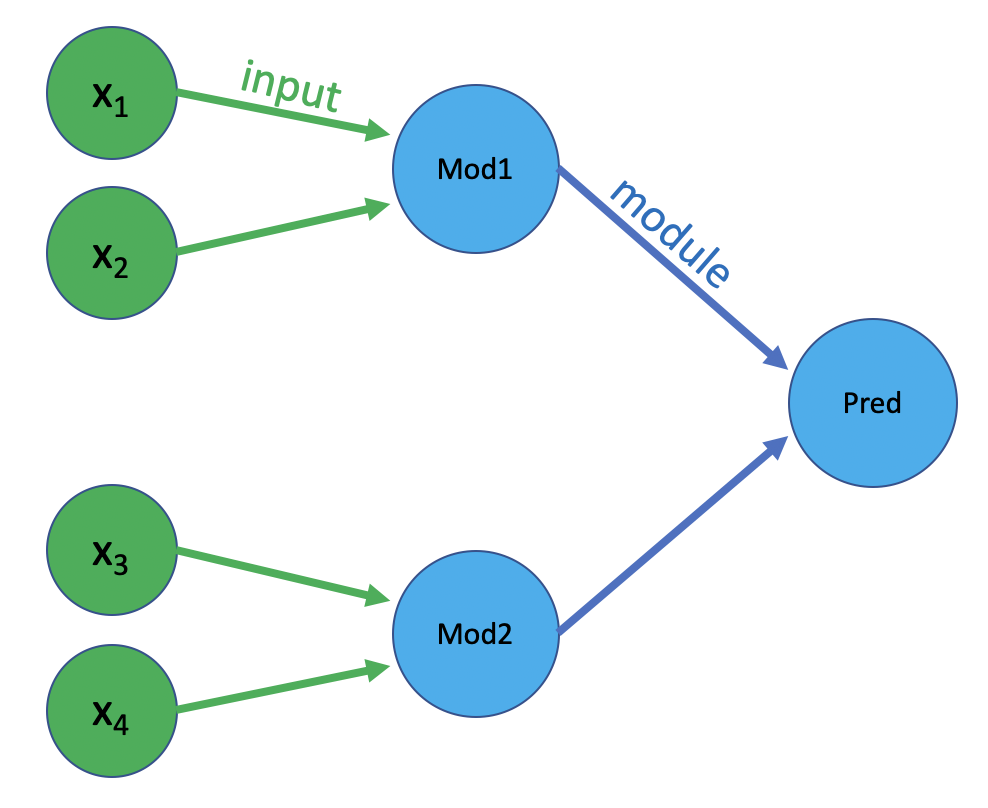

Introduction
============
***KnowledgeNet*** is a eXplainable AI (XAI) framework intended to aid in the creation 
and pruning of Visible Neural Networks (VNNs). *KnowledgeNet* allows for the 
embedding of any hierarchical system within the architecture of a neural network. 
An iterative training and pruning algorithm allows the user to sparsify the 
network down to whatever level is required for downstream tasks. Various readout
formats allow users to view and interpret their networks at diffent levels of 
abstraction and varying degrees of sparsity. Complete package documentation can 
be found [here](https://knowledgenet.readthedocs.io/en/latest/index.html).

*KNowledgeNet* was inspired by 
other VNN frameworks, including by not limited to *DCell*, *DrugCell*, and
*ParsVNN*. See **Related Works** at the bottom of this page for links to similar 
packages and publications.

Motivation
----------

Related Works
-------------

## Use KnowledgeNet

### Setup an experiment
#### Setup the experiment directory

1. **Create a new directory with the name of the experiment to store the data 
files and results of the experiment**. We suggest doing this one level 
up from the knowledge-net directory, but the choice of where to keep the 
directory is irrelevant as long as the correct path is specified in the 
`config.py` file. For example, we create a directory called `regression` 
within the`tests` directory in the KnowledgeNet master folder. The absolute path 
to the folder is then `tests/regression`. 

2. **Within the experiment directory you just created, create two new
   directories called** `data` **and** `results`. These directories already
exist in the regression example experiment. 

3. **Create a new file called** `features.tsv` **in the** `data` **directory**.
The file should be structured as a two-column TSV file, with the first
column titled `id`, and the second column titled `feature`. The `id` column
should begin with `0` and continue until the number of features - 1. The
`feature` column should contain the name of each feature used by the model. 
**Note: Feature names should be entirely lowercase.** See
the `features.tsv` file within `tests/regression/data` folder for an example. 

4. **Create a new file called** `ontology.tsv` **in the** `data` **directory**. 
The file should be structured as a three-column TSV file, with the first column 
titled `parent`, the second column titled `child`, and the third column titled
`relation`. Each line should enumerate 1 relationship between a parent module 
and either a child module or a child feature. For example, condider the ontology 
show in the figure below, where x1 and x2 are children of Mod1, x3 and x4 are 
children of Mod2, and Mod1 and Mod2 are children of Pred (the final prediction).

    

The `ontology.tsv` file should then look like the following:

    parent  child   relation
    Pred    Mod1    module
    Pred    Mod2    module
    Mod1    x1      input
    Mod1    x2      input
    Mod2    x3      input
    Mod2    x4      input

**Note: The first letter of the names of modules (e.g. Mod1, Mod2, Pred) should 
be capitalized. The names of features (x1, x2, etc.) should be entirely 
lowecase.** The ontology file for the regression problem file has been created 
for you in `tests/regression/data`. See it for an additional example. 
Alternatively, this file can be created automatically based on a `modules.csv` 
file (see below).

5. **Specify experiment-specific environment variables in the** `config.py`
   **file in the** `knowledge-net/` **directory.** The  

